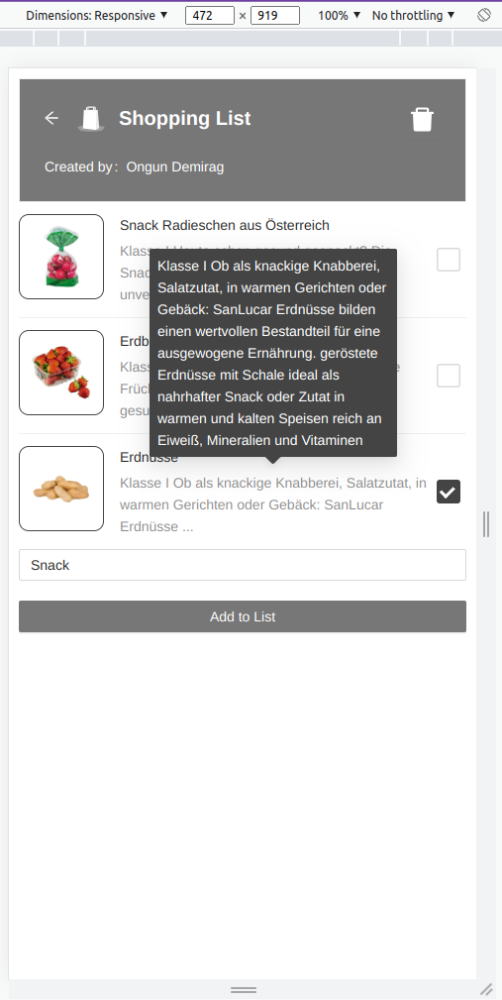

# Coding Example Frontend JS

Coding task solution for Frontend Dev position in Wirecube

## Your task

Create a simple client side shopping list for mobile devices, with these requirements:

- Set up your project in this directory
- Use React for this project, feel free to use any other technology you like (but provide instructions how to build your app)
- Implement the following UI according to the provided wireframe
- Implement functional requirements
- use provided assets in `data` to provide a better experience to the user

### Design & Functionality


This wireframe provides a rough guideline how the app should look like on a mobile phone.
Other viewports can be neglected, but a responsive implementation is highly appreciated.

#### Functional requirements:

- Items can be added via the input + button below

  - if the text entered matches a product from `data/products.json`, try to utilize the available product information to provide a good user experience
  - gray boxes in the design are placeholders for product images.
    In case an image can not be displayed or there was no suitable product found, use `data/fallback.png`.

- Items can be checked and unchecked again
- Delete checked items via the `trash` button at the top

### Data

Available Products are found in `data/products.json`

Product Data:

```json5
{
  id: "...", // a unique identifier of a product
  title: "...", // the product name / text to display
  base64Image: "...", // base64 encoded product image
  price: 2.49, // (not used in this coding example) the current price of the product
  strikePrice: 3.99, // (not used in this coding example) the base price of the product
  description: "", // (not used in this coding example) product description
}
```

### PrintScreens

- 
- 
- 

### Additional packages

- I have installed ant-design for styling purposes.
- Styled-components to modify ant design components based on provided wireframe.
- Typescript to eliminate type mismatch related errors
